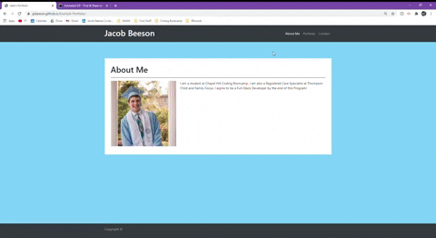

# Example Portfolio
  An example portfolio created using html, css, and bootstrap. Contains an About Me, Portfolio, and non-functional Contact page.
   
  https://jpbeeson.github.io/Example-Portfolio/

  ## Table of Contents
  * [Demo](#demo)
  * [Developer's Information](#devInfo)
  * [License](#license)
  
  ## Demo
  

  ## Developer's Information
  Feel free to contact me using the information below if you have any questions or feedback!
   
  Name: Jacob Beeson
   
  Github Link: github.com/jpbeeson
   
  Email: <beeson.jp@gmail.com>

  ## License
  MIT
